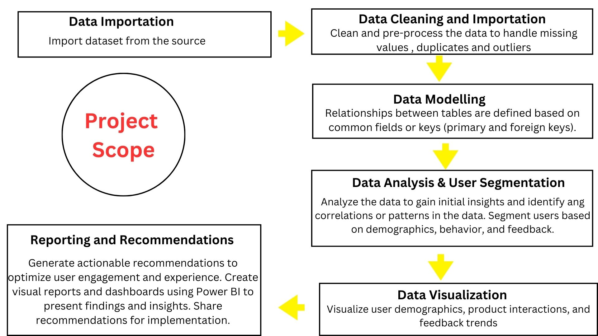
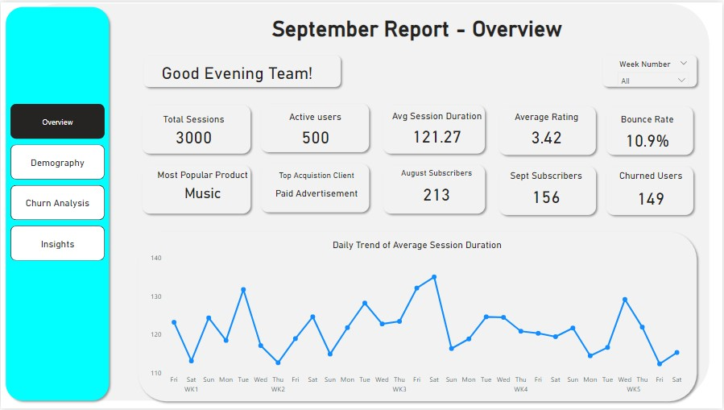
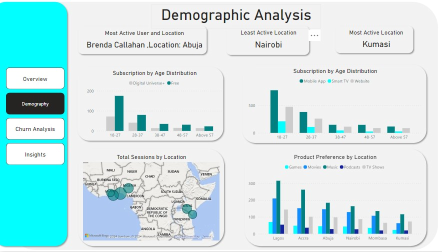
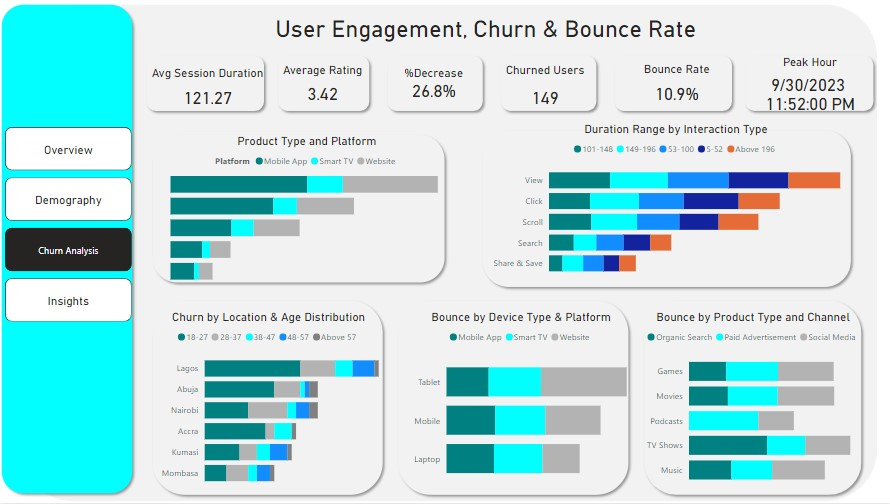

# User Behaviour Analytics: Analyzing Digital Interactions to Optimize User Engagement & Experience at Digital Universe Inc.

Specialization: Customer and Product Analytics

## Company Overview
### Digital Universe Inc.


Digital Universe Inc. is a dynamic player in the digital services industry, positioned at the forefront of innovation and customer service. It offers a comprehensive digital entertainment platform that provides users with access to a vast library of TV shows, music, podcasts, and games. The platform is accessible through web browsers, mobile apps, and smart TVs, ensuring a seamless and immersive entertainment experience. The company's mission to enrich the digital experiences of users worldwide has grown rapidly and amassed a diverse and global user base.

In today's competitive landscape where users' expectations continually evolve, the success and sustainability of the business depend heavily on the ability to understand, adapt to, and exceed users' expectations. The cornerstone of achieving this lies in optimizing user engagement across the full range of digital products and services.

Digital Universe Inc. understands that the key to retaining and attracting more customers is rooted in the capacity to forge meaningful connections with its users. These connections are forged through every interaction a user has with digital products, whether it's exploring a new feature, providing feedback, or simply navigating through the platforms. These interactions are the lifeblood of the business, and their collective impact is what ultimately determines success.

## Business Problem

Digital Universe Inc. is struggling to understand how users interact with their digital products and services. They need to identify patterns, bottlenecks, and areas for improvement to enhance user engagement and experience. Without this understanding, the company risks losing customers to competitors and missing growth opportunities.

User interactions have become increasingly complex due to the variety of devices, platforms, and user preferences. This complexity presents several challenges:

1. **User Interaction**: Understanding how users interact with the company's products and services is crucial for optimization.
2. **User Diversity**: The user base is diverse, with varying preferences, needs, and behaviors. Catering to this diversity is essential for a seamless user experience.
3. **Continuous Improvement**: The company aims to exceed user expectations continually, requiring a proactive approach to identifying areas for improvement.

### Rationale for the Project

User behavior analytics (UBA) involves gathering insights into the daily network events generated by users. This is essential for understanding user preferences, pain points, and behaviors. It helps Digital Universe Inc. make informed decisions to enhance user engagement and experience. By analyzing user interactions, the company can identify popular features, optimize user flows, and personalize content, leading to increased customer satisfaction and retention.

Understanding user needs and preferences helps in:

1. **Personalization**: UBA allows the company to understand individual user interactions, enabling personalized recommendations, content suggestions, and user experiences.
2. **Segmentation**: UBA helps segment users based on behaviors, demographics, and preferences, enabling targeted marketing, content creation, and feature development.
3. **Improving Content Recommendations**: By analyzing interactions like views, clicks, and purchases, the company can identify popular content and areas needing improvement, enhancing content recommendation algorithms.

### Aim of the Project

The project aims to leverage user behavior analysis to optimize user engagement and experience for Digital Universe Inc. By analyzing digital product interactions, the company seeks to identify areas for improvement, enhance user satisfaction, and ultimately increase customer retention and revenue.

Digital Universe Inc. aims to:

1. Identify which user types have the highest bounce rates.
2. Understand which features and content resonate most with different user segments.
3. Tailor products and services to meet the unique preferences of various user groups.
4. Continuously improve offerings based on real-time user feedback and data-driven insights.



## Data Importation
**Creating a Date Table in Power BI**

1. **Create Date Parameters:**
   - **Start Date:** 
     - Go to **Transform Data** > **Manage Parameters** > **New Parameter**.
     - Name it "startDate", set type to **Date**, and input '2023/09/01'.
   - **End Date:** 
     - Repeat the above steps, name it "endDate", and input '2023/09/30'.

2. **Generate Date Table:**
   - Click **New Source** > **Blank Query** and rename it to "Date Table".
   - In **Advanced Editor**, rename the source to "Duration".
   - Calculate the number of days: 
     ``` 
     = Duration.Days(endDate - startDate) + 1 
     ```
   - List the dates: 
     ``` 
     = List.Dates(startDate, Duration, #duration(1, 0, 0, 0)) 
     ```
   - Convert to table: **Transform Tab** > **To Table** > **OK**.
   - Rename it to "Date Table" and change the type to **Date**.
**Note: The (1,0,0,0) means one day, zero hours, zero minutes and zero seconds**

3. **Add Columns:**
   - Go to **Add Column Tab** > **Date** and add **Year**, **Week of Month**, **Day**, **Name of Day**.
   - Extract first 3 characters of day names: **Transform Tab** > **Extract** > **First Characters** > 3 > **OK**.
   - Add "Day of Week" column.
   - Create a custom column for week names:
     ``` 
     = "WK" & ([Week of Month]) 
     ```
   - This returned an error because 'WK' is a text and [Week of Month] is an integer. So to fix this I have to use the text.from function
   ```
   = "WK" & Text.From([Week of Month])
   ```
   - Click **Close and Apply**.

5. **Sort and Finalize:**
   - In **Table View**, sort **Day Name** by **Day of Week** and **Week Number** by **Week of Month**.
   - Mark as date table: **Table Tools** > **Mark as Date Table** > **Date Column** > **Date Table** > **OK**.


### Creating a Data Model and Performing Data Exploration in Power BI

1. **Create Data Model:**
   - Power BI automatically connects the `user-profile_data 2` table to the `Session_data 2` table via the `UserID` column.
   - Connect the `Date` column in the `Session_data 2` table with the `Date Table`.

2. **Data Exploration:**
   - **Total Sessions Calculation:**
     - Click **Enter Data** in the Home tab.
     - Rename the table to `Measures Table`.
     - Create a new measure to calculate total sessions:
       ``` 
       Total Sessions = COUNTROWS('Session_data 2') 
       ```

   - **Active Users in Previous Month:**
     - Create a new measure:
       ``` 
       Active Users = COUNTROWS('user_profile_data 2') 
       ```

   - **Average Session Duration:**
     - Create a new measure:
       ``` 
       Average Session Duration = AVERAGE('Session_data 2'[Duration]) 
       ```

   - **Average User Rating:**
     - Create a new measure:
       ``` 
       Average Rating = AVERAGE('Session_data 2'[Rating]) 
       ```

   - **Bounce Rate Calculation:**
     - Define bounce rate threshold:
       ``` 
       Bounce Defined = 30 
       ```
     - Create a DAX formula for bounce rate:
       ``` 
       Bounce Rate = DIVIDE(
           COUNTROWS(FILTER('Session_data 2', 'Session_data 2'[Duration] < 'Measures Table'[Bounce Defined])),
           COUNTROWS('Session_data 2')
       ) 
       ```

   - **Most Popular Product Type:**
     - Create a measure to find the most popular product:
       ``` 
       Most Popular Product Type = 
       VAR TopProduct = 
           TOPN(
               1,
               ADDCOLUMNS(
                   VALUES('Session_data 2'[Product Type]),
                   "ProductCount", CALCULATE(COUNTROWS('Session_data 2'))
               ),
               [ProductCount], DESC
           )
       RETURN 
           MAXX(TopProduct, 'Session_data 2'[Product Type]) 
       ```

   - **Top Acquisition Channel:**
     - Create a measure to find the top acquisition channel:
       ``` 
       Top Acquisition Channel = 
       VAR TopChannel = 
           TOPN(
               1,
               VALUES('Session_data 2'[Channel]),
               COUNTROWS(FILTER('Session_data 2', 'Session_data 2'[Channel] = EARLIER('Session_data 2'[Channel])))
           )
       RETURN MAXX(TopChannel, [Channel]) 
       ```

- **Compare Subscribers and Churn Rate:**
   - **Churned Users Calculation:**
     ``` 
     Churned Users = 
     COUNTROWS(FILTER('user_profile_data 2',
     'user_profile_data 2'[Aug_sub_type] = "Digital Universe+" && 'user_profile_data 2'[Sept_sub_type] = "Free"))
     ```

   - **Percentage Decrease in Churn Rate:**
     ``` 
     Percentage Decrease = DIVIDE([Aug Subscribed Users] - [Sept Subscribed Users], [Aug Subscribed Users])
     ```

- **Add Welcome Text:**
   - Create a measure to display a greeting based on the time of day:
     ``` 
     Welcome Text = 
     VAR hour = HOUR(NOW()) 
     VAR Greeting = SWITCH(TRUE(), 
         hour >= 0 && hour < 5, "Good Morning Team!", 
         hour >= 5 && hour < 12, "Good Morning Team!", 
         hour >= 12 && hour < 18, "Good Afternoon Team!", 
         hour >= 18 && hour < 24, "Good Evening Team!") 
     RETURN Greeting
     ```

- **Design Dashboard:**
   - Use the calculated measures and welcome text to create an engaging and informative dashboard for stakeholders and team members.




## **Demography Page:**
   - **Most Active User with Location:**
     ``` 
     MostActiveUserWithLocation = 
     VAR MostActiveUserID = 
         TOPN(
             1,
             VALUES('session_data 2'[UserID]),
             COUNTROWS(FILTER('session_data 2', 'session_data 2'[UserID] = EARLIER('session_data 2'[UserID])))
         )
     VAR MostActiveUserName = 
         LOOKUPVALUE('user_profile_data 2'[Name],
         'user_profile_data 2'[UserID],
         MAXX(MostActiveUserID, [UserID])
     )
     VAR UserLocation = 
         LOOKUPVALUE(
             'user_profile_data 2'[Location],
             'user_profile_data 2'[UserID],
             MAXX(MostActiveUserID, [UserID])
         )
     RETURN
     MostActiveUserName & UNICHAR(10) & ", Location: " & UserLocation
     ```

   - **Most Active Location:**
     ``` 
     Most Active Location = FIRSTNONBLANK(TOPN(1, VALUES('user_profile_data 2'[Location]), [Average Session Duration]), 1)
     ```

   - **Subscribers by Age Distribution:**
     - Create a new column to divide subscribers into age groups:
       - 18-27
       - 28-37
       - 38-47
       - 48-57
       - Above 57
---




## **Churn Analysis Page:**
   - **Peak Hours Calculation:**
     ``` 
     PeakHour = 
     VAR MaxSessionCount = MAXX(SUMMARIZE('session_data 2', 'session_data 2'[Start Time], 'user_profile_data 2'[UserID],
     "SessionCount", COUNTROWS('session_data 2')), [SessionCount])
     RETURN
     MAXX(FILTER(SUMMARIZE('session_data 2', 'session_data 2'[Start Time], 'user_profile_data 2'[UserID],
     "SessionCount", COUNTROWS('session_data 2')),[SessionCount] = MaxSessionCount), [Start Time])
     ```

   - **Customer Behavior Analysis:**
     - Investigate if users who spend longer hours on the platform perform specific actions or a set of actions.
---

---
## Insights and Recommendations

## Churn Analysis

- **Lagos:** Highest churn rate, with 18-27 age group making up 14.77% of churned users.
- **Nairobi:** Highest churn in the 28-37 age group.

## Session Duration Insights

- **5-52 minutes:** Highest total sessions (626).
- **Above 196 minutes:** Lowest total sessions (543).
- **101-148 minutes:** Accounts for 6.50% of total sessions.
- **5-52 minutes:** Highest average sessions (125.20).
- **Above 196 minutes:** Lowest average sessions (108.60).

## Platform Performance

- **Mobile App:** Highest total sessions (1,564), followed by Website (1,021) and Smart TV (415).
- **Music on Mobile App:** 20.03% of total sessions.
- **Mobile App:** Highest average sessions (312.80), followed by Website (204.20) and Smart TV (83).

## Trends (Sept 1-30, 2023)

- **Share & Save:** Largest increase in sessions (42.86%).
- **Search and Click:** Largest decrease in sessions (14.29%).
- **Anomaly:** Search sessions dropped to 5 on Sept 19.
- **Share & Save:** Sessions increased by 11.11% from Sept 24.
- **Ratings:** Decreased by 2.59%.
- **Avg Session Duration:** Decreased by 6.41%, with a steep drop from 124.59 to 115.28 between Sept 19-30.

## Advertising Channels

- **Paid Advertisement:** Highest total sessions (1,544), followed by Social Media (922) and Organic Search (534).
- **Paid Advertisement:** Highest average sessions (308.80), followed by Social Media (184.40) and Organic Search (106.80).

## Recommendations

- Survey churned users to understand reasons for leaving.
- Offer loyalty programs or discounts to at-risk users.
- Improve user onboarding and support.
- Invest in popular product types to boost engagement.
- Address issues highlighted by lower user ratings.
- Use push notifications during low-activity periods to re-engage users.
- Tailor marketing campaigns to primary demographics.
- Address demographic-specific issues to improve satisfaction and retention.
- Consider partnerships appealing to key demographic segments.
